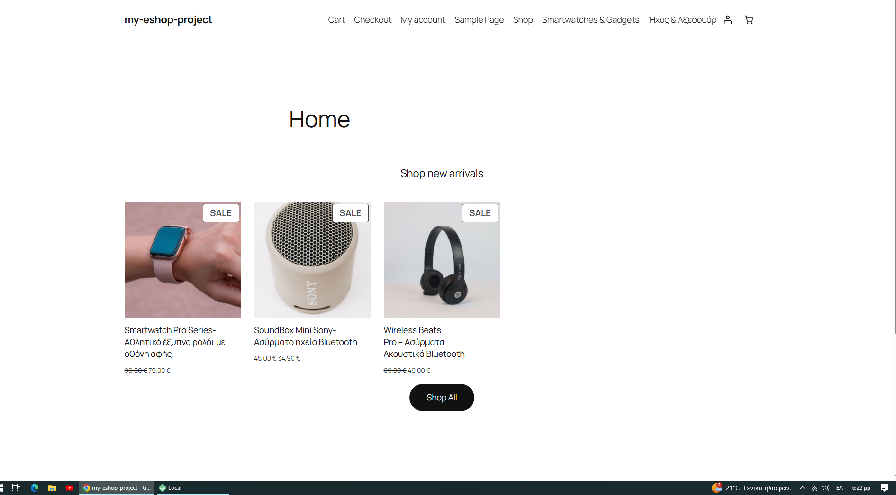
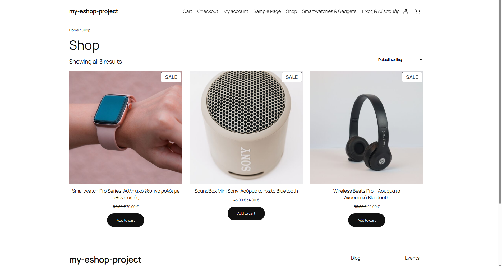
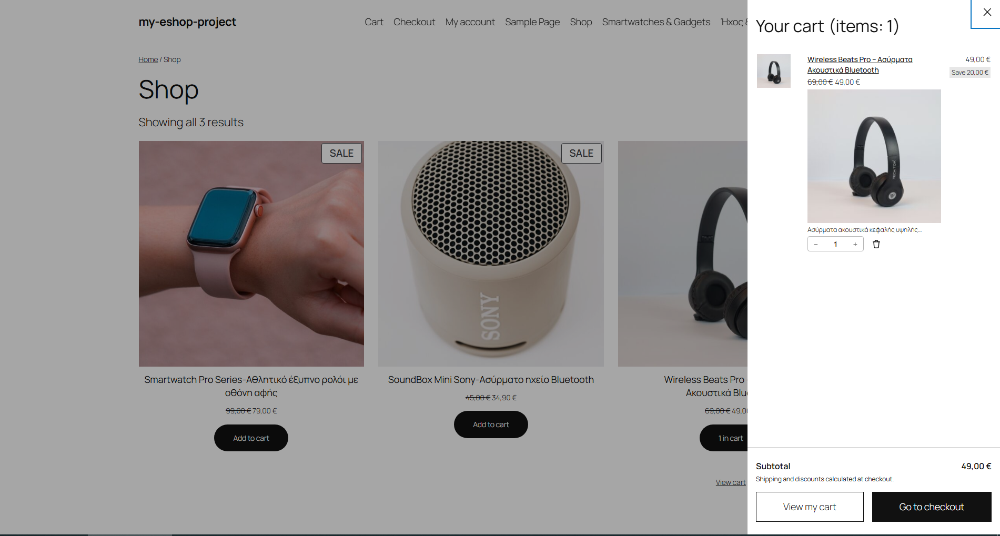

# Professional WooCommerce E-Commerce Store

A fully responsive and operational e-commerce web application developed using WordPress and WooCommerce. This project demonstrates professional store setup, custom category navigation, product management, and a complete user purchasing journey from browsing to checkout.

## 🛠️ Technologies & Tools
- **CMS:** WordPress
- **E-commerce Plugin:** WooCommerce
- **Editor:** Gutenberg Block Editor
- **Environment:** Localhost (Development)

## 🌟 Key Features
- **Custom Navigation:** Configured custom category links (`Smartwatches & Gadgets`, `Ήχος & Αξεσουάρ`) to resolve menu routing errors and ensure seamless browsing.
- **Dynamic Homepage:** Designed a custom static homepage featuring curated product grids, promotional sale badges, and a direct "Shop All" call-to-action.
- **E-Commerce Workflow:** Full operational workflow covering the store catalog, single product views, interactive shopping cart, and secure checkout simulation.
- **Responsive Design:** Optimized layout for fluid responsiveness across various devices.

## 📸 Project Screenshots

| Homepage Showcase | Store Catalog (Shop) |
| :---: | :---: |
|  |  |

| Shopping Cart & Items | Single Product View |
| :---: | :---: |
|  |  |
